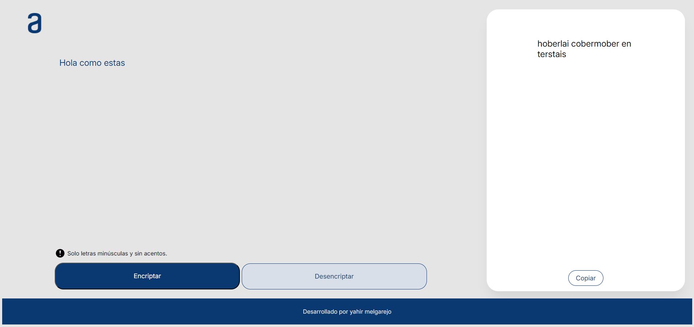

<h1>Encriptador de Texto</h1>
Descripción
Web para encriptar y desencriptar textos utilizando un algoritmo simple.

<h1>Características</h1>
Encriptación: Ingresas un texto y la web lo encriptara de manera simple.

Desencriptación: Ingresa un texto encriptado con la misma web y te regresara el mensaje original.

<h1>Instalación</h1>
Clona el repositorio utilizando git clone https://github.com/Dev-YahirMT/encriptador-de-texto.git

Da clic en el archivo index.html y podras usarlo en tu navegador web.
