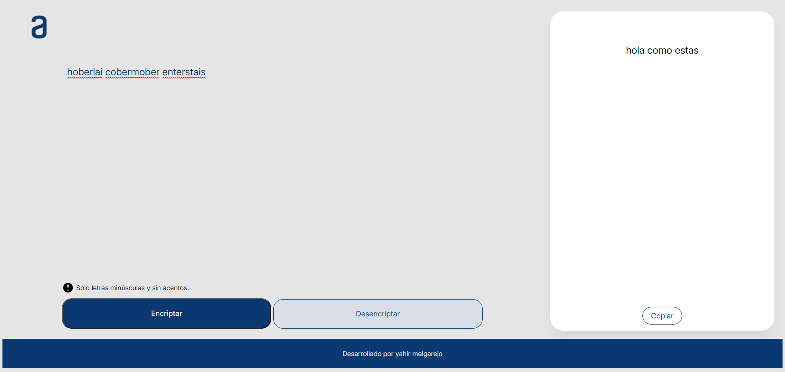

<h1>Encriptador de Texto</h1>
Descripción
Web para encriptar y desencriptar textos utilizando un algoritmo simple.

<h1>Características</h1>
Encriptación: Ingresas un texto y la web la encriptara de manera simple.

Desencriptación: Ingresa un texto encriptado con la misma web y te regresara el mensaje original.

